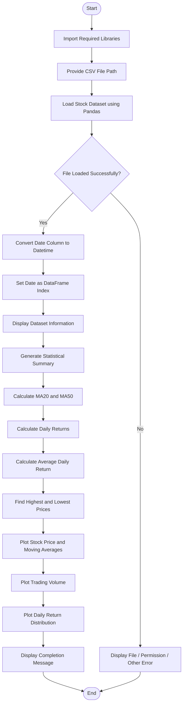
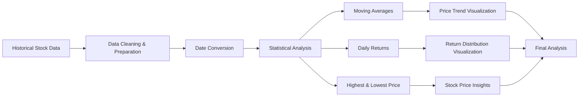
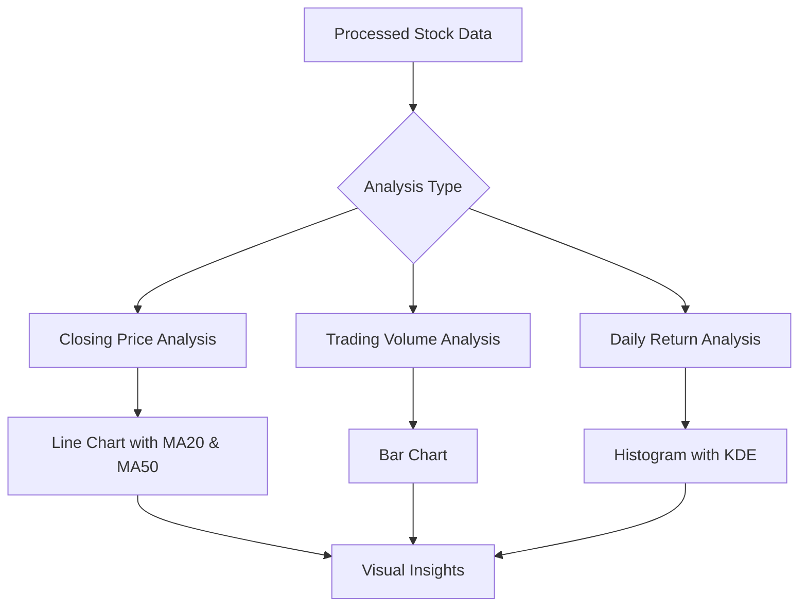
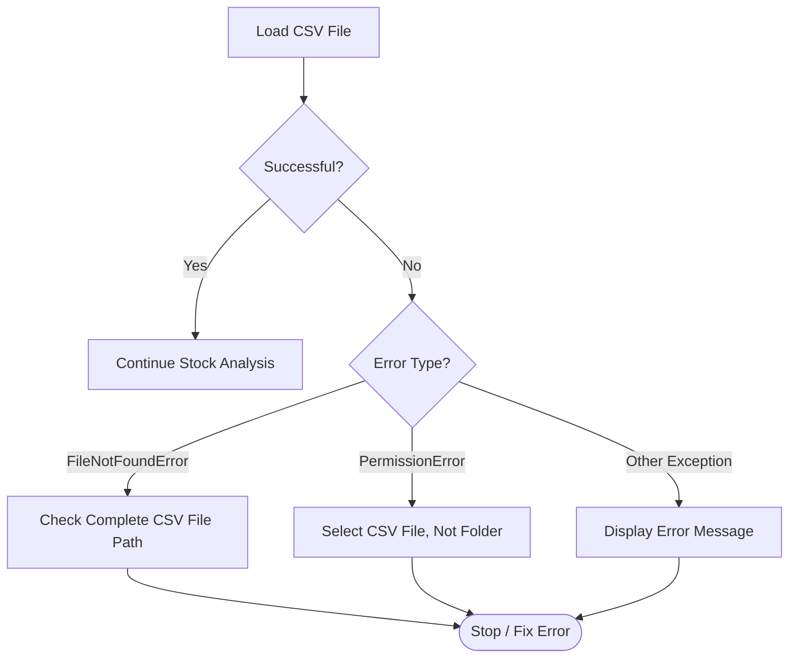

# 📈 Stock Market Analysis

A Python-based **Stock Market Analysis and Visualization** project that loads historical stock market data from a CSV file, performs statistical analysis, calculates moving averages and daily returns, and creates informative visualizations.

## ✨ Features

- 📂 Load historical stock data from a CSV file
- 🔍 Display dataset preview, rows, and columns
- 📊 Generate dataset information and statistical summary
- 📈 Calculate **20-Day Moving Average (MA20)**
- 📉 Calculate **50-Day Moving Average (MA50)**
- 💹 Calculate daily percentage returns
- 🧮 Calculate average daily return
- 🔺 Find the highest stock price
- 🔻 Find the lowest stock price
- 📈 Visualize closing prices with moving averages
- 📊 Analyze trading volume
- 📉 Visualize the distribution of daily returns
- ⚠️ Handle file-not-found and permission errors

---

## 🛠️ Technologies Used

| Technology | Purpose |
|---|---|
| Python | Core programming language |
| Pandas | Data loading and analysis |
| Matplotlib | Data visualization |
| Seaborn | Statistical visualization |
| OS Module | File path and filename handling |

---

## 📁 Project Structure

```text
Stock-Market-Analysis/
│
├── stock_market_analysis.py
├── stock_data.csv
└── README.md
```

> **Note:** The Python program expects a CSV dataset containing stock market data.

---

## 📊 Expected Dataset Columns

The CSV file should contain columns similar to:

```text
Date, Open, High, Low, Close, Volume
```

The program converts the `Date` column to datetime format and uses it as the DataFrame index.

---

# 🔄 Project Workflow



---

# 📈 Analysis Flowchart



---

## ⚙️ Installation

### 1. Clone or Download the Project

Place the following files in the same project folder:

- `stock_market_analysis.py`
- `stock_data.csv`

### 2. Install Required Libraries

```bash
pip install pandas matplotlib seaborn
```

### 3. Update the CSV File Path

Open `stock_market_analysis.py` and update:

```python
file_path = r"C:\Users\Armin Khareghat\OneDrive\Desktop\AI ML data science\Python\python-projects\stock market analysis\stock_data.csv"
```

Example:

```python
file_path = r"C:\Users\Armin Khareghat\OneDrive\Desktop\AI ML data science\Python\python-projects\stock market analysis\stock_data.csv"
```

### 4. Run the Program

```bash
python stock_market_analysis.py
```

---

# 🧠 How the Program Works

## 1️⃣ Load Stock Dataset

The program reads the CSV file using Pandas.

```python
df = pd.read_csv(file_path)
```

It also handles:

- `FileNotFoundError`
- `PermissionError`
- Other unexpected exceptions

---

## 2️⃣ Convert Date Column

The `Date` column is converted into datetime format.

```python
df["Date"] = pd.to_datetime(df["Date"])
```

Then it is set as the DataFrame index.

```python
df.set_index("Date", inplace=True)
```

---

## 3️⃣ Statistical Analysis

The program displays:

- Dataset information
- Data types
- Statistical summary
- Count
- Mean
- Standard deviation
- Minimum and maximum values

```python
df.info()
df.describe()
```

---

## 4️⃣ Moving Average Calculation

Two moving averages are calculated:

### 📌 20-Day Moving Average

```python
df["MA20"] = df["Close"].rolling(window=20).mean()
```

### 📌 50-Day Moving Average

```python
df["MA50"] = df["Close"].rolling(window=50).mean()
```

Moving averages help identify stock price trends over time.

---

## 5️⃣ Daily Return Calculation

Daily return is calculated using the percentage change in closing price.

```python
df["Daily Return"] = df["Close"].pct_change() * 100
```

The program also calculates the average daily return.

```python
average_return = df["Daily Return"].mean()
```

---

## 6️⃣ Highest and Lowest Stock Price

The program finds:

```python
highest_price = df["High"].max()
lowest_price = df["Low"].min()
```

This provides a quick view of the stock's price range.

---

# 📊 Visualizations

## 📈 Stock Price and Moving Averages

The program plots:

- Closing Price
- 20-Day Moving Average
- 50-Day Moving Average

This visualization helps analyze short-term and long-term price trends.

## 📊 Trading Volume

A bar chart displays trading volume over time.

## 📉 Daily Return Distribution

A histogram with KDE displays the distribution of daily percentage returns.

---

# 🧩 Visualization Workflow



---

## 🖥️ Expected Output

The program displays:

1. File loading status
2. CSV filename
3. Total rows and columns
4. First five dataset records
5. Dataset information
6. Statistical summary
7. Moving average values
8. Daily returns
9. Average daily return
10. Highest and lowest stock prices
11. Stock price visualization
12. Trading volume visualization
13. Daily return distribution
14. Final completion message

Example:

```text
File Loaded Successfully!
stock_data: stock_data.csv
Total Rows: ...
Total Columns: ...

----- Historical Stock Data -----
...

----- Dataset Information -----
...

Average Daily Return: ... %

Highest Stock Price: ...
Lowest Stock Price: ...

Stock Market Analysis Completed!
```

---

# 🚨 Error Handling Flow



---

## 🎯 Learning Outcomes

By completing this project, you can understand:

- CSV file handling with Pandas
- DataFrames and indexing
- Datetime conversion
- Statistical data analysis
- Rolling window calculations
- Moving averages
- Percentage change calculations
- Error handling with `try-except`
- Data visualization using Matplotlib
- Statistical visualization using Seaborn

---

## 🚀 Future Improvements

Possible future enhancements include:

- Support for multiple stock CSV files
- User input for stock file selection
- Interactive visualizations
- Technical indicators such as RSI and MACD
- Automatic report generation
- GUI-based stock analysis dashboard
- Real-time stock market data integration

---

## 👨‍💻 Project Summary

This **Stock Market Analysis** project demonstrates how Python can be used to process and analyze historical stock market data. It combines **data analysis, statistical calculations, moving averages, return analysis, error handling, and visualization** into one complete project.

---

## 🏁 Conclusion

The project provides a practical introduction to **data analysis and visualization using Python**. By analyzing historical stock data, users can understand price trends, trading activity, daily returns, and important statistical information.

---

## 👨‍💻 Author

**Armin Khareghat**  
B.Sc. Computer Science  
🤖 AI / ML & Data Science 

---

## 📜 License

This project is created for **educational and learning purposes**.

---

### ⭐ If you found this project useful, consider giving the repository a star!
